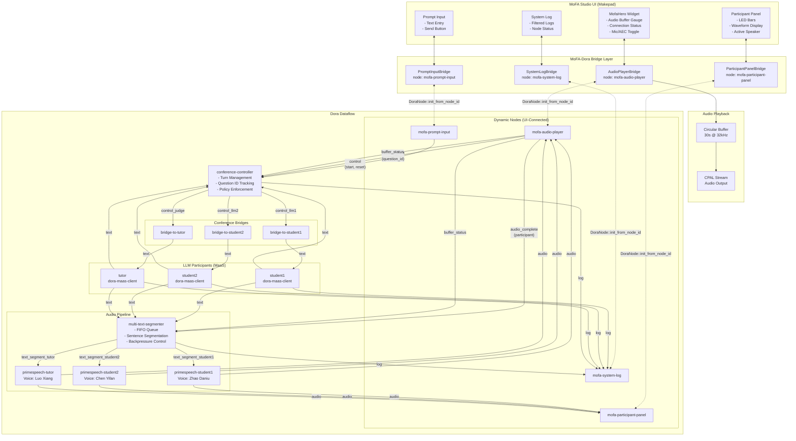
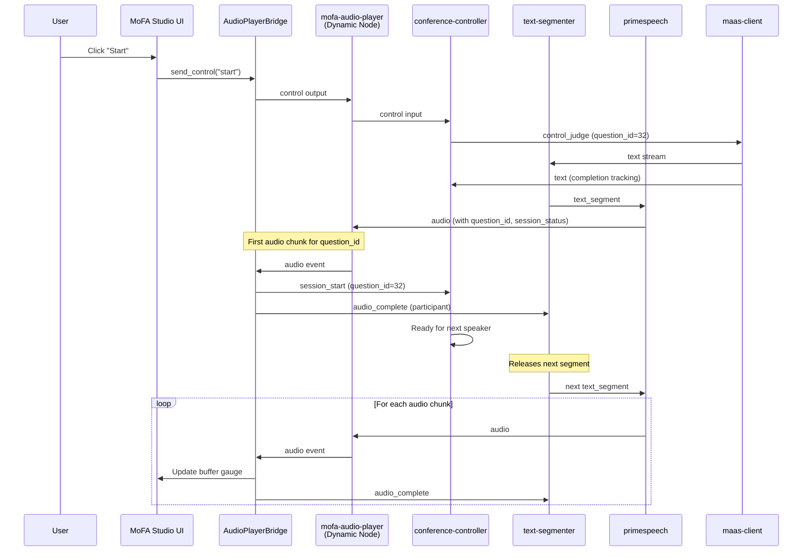
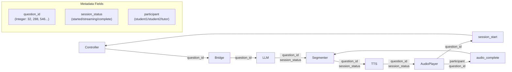

# MoFA Studio - Dora Integration Architecture

This document describes the architecture of MoFA Studio's integration with the Dora dataflow framework for real-time multi-participant voice conversations.

## Key Features

- **Human Speaker Support**: Real-time voice input with macOS AEC (Acoustic Echo Cancellation)
- **Multi-Participant Conversation**: 3 AI participants (student1, student2, tutor) + human
- **Priority-Based Turn Management**: Human has highest priority and can interrupt AI speakers
- **Backpressure Control**: Audio buffer management prevents pipeline stalls
- **Smart Reset**: question_id-based filtering for clean state transitions

## System Overview



## Component Layers

### 1. UI Layer (Makepad Widgets)

| Widget | Purpose |
|--------|---------|
| `MofaHero` | Main hero display with audio buffer gauge, connection status, mic/AEC toggle |
| `ParticipantPanel` | LED visualization bars showing audio levels and active speaker |
| `PromptInput` | Text input for user prompts and control buttons |
| `SystemLog` | Aggregated log display with level filtering |

### 2. Bridge Layer (mofa-dora-bridge)

Bridges connect Makepad UI widgets to Dora dynamic nodes. Each bridge:
- Runs a background thread with Dora event loop
- Uses `DoraNode::init_from_node_id()` to attach to the dataflow
- Translates between Dora Arrow data and Rust types
- Handles metadata extraction (String, Integer, Float, Bool, Lists)

| Bridge | Node ID | Inputs | Outputs |
|--------|---------|--------|---------|
| `AudioPlayerBridge` | mofa-audio-player | audio_student1, audio_student2, audio_tutor | session_start, audio_complete, buffer_status |
| `ParticipantPanelBridge` | mofa-participant-panel | audio_student1, audio_student2, audio_tutor | - |
| `PromptInputBridge` | mofa-prompt-input | llm*_text, llm*_status | control |
| `SystemLogBridge` | mofa-system-log | *_log, *_status | - |

### 3. Dora Dataflow Layer

The dataflow consists of:
- **LLM Participants**: 3 `dora-maas-client` instances (student1, student2, tutor)
- **Conference Bridges**: Route text between participants based on controller signals
- **Controller**: Manages turn-taking with configurable policy
- **Text Segmenter**: FIFO queue with sentence segmentation and backpressure
- **TTS Nodes**: PrimeSpeech instances with different voices

## Signal Flow Sequence



## Critical Metadata Flow



### Metadata Parameter Types

The metadata extraction must handle all Dora parameter types:

```rust
let string_value = match value {
    Parameter::String(s) => s.clone(),
    Parameter::Integer(i) => i.to_string(),  // question_id is Integer!
    Parameter::Float(f) => f.to_string(),
    Parameter::Bool(b) => b.to_string(),
    Parameter::ListInt(l) => format!("{:?}", l),
    Parameter::ListFloat(l) => format!("{:?}", l),
    Parameter::ListString(l) => format!("{:?}", l),
};
```

## Critical Signals

### 1. `session_start`
- **From**: mofa-audio-player
- **To**: conference-controller
- **Purpose**: Signals that audio playback has begun for a question_id
- **Trigger**: First audio chunk received for a new question_id
- **Required Metadata**: `question_id`, `participant`

### 2. `audio_complete`
- **From**: mofa-audio-player
- **To**: multi-text-segmenter
- **Purpose**: Flow control - releases next segment from FIFO queue
- **Trigger**: Every audio chunk received
- **Required Metadata**: `participant`, `question_id`, `session_status`

### 3. `buffer_status`
- **From**: mofa-audio-player
- **To**: conference-controller, multi-text-segmenter
- **Purpose**: Backpressure control based on audio buffer fill level
- **Values**: 0-100 (percentage)

## Audio Pipeline Details

### Circular Buffer
- **Duration**: 30 seconds
- **Sample Rate**: 32,000 Hz
- **Format**: Mono f32 samples
- **Behavior**: Overwrites oldest samples when full

### Channel Buffers
- **Audio Channel**: 500 items (non-blocking with `try_send()`)
- **Event Channel**: 100 items
- **Buffer Status Channel**: 10 items

## Human Speech Interrupt

When a human starts speaking, AI audio playback must stop immediately. This requires two mechanisms working together:

### Problem

Without proper interrupt handling:
1. **Latency**: UI polling runs every ~100ms, causing noticeable delay before audio stops
2. **Stale Audio**: Audio chunks already in-flight in the Dora pipeline play briefly after reset

### Solution Architecture

```
┌─────────────────────────────────────────────────────────────────────────────┐
│                     Human Speech Interrupt Flow                              │
│                                                                              │
│  1. Human speaks                                                             │
│     │                                                                        │
│     ▼                                                                        │
│  mofa-mic-input ──► speech_started ──► conference-controller                 │
│                                              │                               │
│                                              ▼                               │
│                                         Increments question_id               │
│                                         Sends reset with NEW question_id     │
│                                              │                               │
│     ┌────────────────────────────────────────┘                               │
│     │                                                                        │
│     ▼                                                                        │
│  mofa-audio-player (AudioPlayerBridge)                                       │
│     │                                                                        │
│     ├──► 1. signal_clear() ──► Sets force_mute = true (INSTANT MUTE)        │
│     │                          Clears SharedDoraState audio buffer           │
│     │                                                                        │
│     └──► 2. filtering_mode = true, reset_question_id = NEW                   │
│          (SMART RESET - rejects stale audio)                                 │
│                                                                              │
│  Audio Callback Thread (runs every ~2ms):                                    │
│     │                                                                        │
│     └──► Checks force_mute FIRST ──► Outputs silence if true                 │
│                                                                              │
│  Later, audio arrives:                                                       │
│     │                                                                        │
│     ├── question_id=OLD ──► REJECTED (filtering_mode active)                 │
│     │                                                                        │
│     └── question_id=NEW ──► ACCEPTED, exits filtering_mode                   │
│                              Clears force_mute, resumes playback             │
└─────────────────────────────────────────────────────────────────────────────┘
```

### 1. Instant Audio Mute (Force Mute)

The audio callback runs on its own thread and reads from a circular buffer every ~2ms. To achieve instant silencing without waiting for UI polling:

**Shared State:**
```rust
// AudioPlayer (UI) creates the flag
force_mute: Arc<AtomicBool>

// SharedDoraState.AudioState holds a reference
force_mute_flag: RwLock<Option<Arc<AtomicBool>>>
```

**Registration (in init_dora):**
```rust
integration.shared_dora_state().audio.register_force_mute(
    player.force_mute_flag()
);
```

**signal_clear() Implementation:**
```rust
pub fn signal_clear(&self) {
    // Set force_mute FIRST for instant silencing
    if let Some(ref flag) = *self.force_mute_flag.read() {
        flag.store(true, Ordering::Release);
    }
    // Also clear pending audio chunks
    self.clear();
}
```

**Audio Callback:**
```rust
move |data: &mut [f32], _| {
    // Check force_mute FIRST - instant silencing
    if force_mute_clone.load(Ordering::Acquire) {
        for sample in data.iter_mut() {
            *sample = 0.0;
        }
        return;
    }
    // Normal buffer read...
}
```

**Latency**: < 1ms (next audio callback frame)

### 2. Smart Reset (Question ID Filtering)

After a reset, stale audio chunks (from the previous question) may still be in-flight in the Dora pipeline. Playing these would cause brief "garbled" audio.

**State Variables:**
```rust
let mut filtering_mode = false;
let mut reset_question_id: Option<String> = None;
```

**On Reset:**
```rust
if let Some(ref qid) = new_question_id {
    // Smart reset - clear buffer and enter filtering mode
    ss.audio.signal_clear();
    *filtering_mode = true;
    *reset_question_id = Some(qid.clone());
} else {
    // Full reset - just clear, no filtering
    ss.audio.signal_clear();
    *filtering_mode = false;
}
```

**On Audio Arrival:**
```rust
if *filtering_mode {
    match (&incoming_qid, &reset_question_id) {
        (Some(incoming), Some(expected)) if incoming == expected => {
            // Matching question_id - exit filtering mode
            *filtering_mode = false;
        }
        (Some(incoming), Some(expected)) => {
            // Stale audio - REJECT
            return;
        }
        _ => {
            // No question_id - assume new, exit filtering
            *filtering_mode = false;
        }
    }
}
// Process audio normally...
```

### Reset Types

| Reset Type | question_id | Behavior |
|------------|-------------|----------|
| **Full Reset** | None | Clear buffer, no filtering |
| **Smart Reset** | Present | Clear buffer + filter by question_id |

### Comparison with Python Implementation

| Feature | Python (`audio_player.py`) | Rust (`AudioPlayerBridge`) |
|---------|---------------------------|---------------------------|
| Instant mute | Direct `buffer.reset()` | `force_mute: Arc<AtomicBool>` |
| Filtering mode | `filtering_mode` bool | `filtering_mode` bool |
| Question ID tracking | `reset_question_id` | `reset_question_id: Option<String>` |
| Stale audio rejection | `continue` (skip) | `return` (skip) |

The key difference is that Python's audio player IS the Dora node (direct event handling), while Rust uses a bridge pattern with SharedDoraState for UI communication. The `force_mute` mechanism compensates by providing direct atomic access to the audio callback thread.

### Signal Flow

```mermaid
sequenceDiagram
    participant Human
    participant MicInput as mofa-mic-input
    participant Controller as conference-controller
    participant AudioBridge as AudioPlayerBridge
    participant AudioState as SharedDoraState.audio
    participant Callback as Audio Callback Thread
    participant TTS as primespeech

    Human->>MicInput: Speaks
    MicInput->>Controller: speech_started
    Controller->>Controller: question_id++ (5 → 6)
    Controller->>AudioBridge: reset (question_id=6)

    AudioBridge->>AudioState: signal_clear()
    AudioState->>Callback: force_mute = true
    Note over Callback: Outputs silence immediately

    AudioBridge->>AudioBridge: filtering_mode = true<br/>reset_question_id = "6"

    TTS->>AudioBridge: audio (question_id=5)
    Note over AudioBridge: REJECTED (stale)

    TTS->>AudioBridge: audio (question_id=6)
    Note over AudioBridge: ACCEPTED
    AudioBridge->>AudioBridge: filtering_mode = false
    AudioBridge->>AudioState: push(audio)
    AudioState->>Callback: force_mute = false
    Note over Callback: Resumes playback
```



## Human Speaker Input (AEC Input Bridge)

The AEC Input Bridge (`mofa-mic-input`) captures human voice with optional echo cancellation and provides VAD-based speech segmentation.

### Architecture

```
┌─────────────────────────────────────────────────────────────────────────┐
│                         MoFA Studio UI                                   │
│  ┌────────────────┐     ┌────────────────┐                              │
│  │  Mic Mute Btn  │     │  AEC Toggle Btn │ ← Red=speaking             │
│  │  (start/stop)  │     │  (AEC on/off)   │   Green=silent             │
│  └───────┬────────┘     └───────┬─────────┘   Gray=disabled            │
│          │                      │                                        │
│          ▼                      ▼                                        │
│  ┌────────────────────────────────────────┐                             │
│  │        DoraIntegration                  │                             │
│  │  • start_recording()                    │                             │
│  │  • stop_recording()                     │                             │
│  │  • set_aec_enabled(bool)               │                             │
│  └──────────────┬─────────────────────────┘                             │
└─────────────────┼───────────────────────────────────────────────────────┘
                  │ Commands via channel
                  ▼
┌─────────────────────────────────────────────────────────────────────────┐
│              AecInputBridge (Worker Thread)                             │
│  ┌────────────────────┐     ┌────────────────────┐                     │
│  │ NativeAudioCapture │     │   CpalMicCapture   │                     │
│  │ (AEC enabled)      │     │   (No AEC)         │                     │
│  │ • libAudioCapture  │     │   • CPAL stream    │                     │
│  │ • Hardware VAD     │     │   • Energy VAD     │                     │
│  └─────────┬──────────┘     └─────────┬──────────┘                     │
│            │                          │                                 │
│            └──────────┬───────────────┘                                 │
│                       ▼                                                 │
│            ┌──────────────────────┐                                     │
│            │   VAD Segmentation   │                                     │
│            │ • speech_started     │                                     │
│            │ • speech_ended       │                                     │
│            │ • question_ended     │                                     │
│            │ • audio_segment      │                                     │
│            └──────────┬───────────┘                                     │
│                       │                                                 │
│            ┌──────────▼───────────┐                                     │
│            │   SharedDoraState    │                                     │
│            │ • mic.level          │ ← UI polls for LED meter           │
│            │ • mic.is_speaking    │ ← AEC button color                 │
│            │ • mic.aec_enabled    │ ← AEC button state                 │
│            └──────────────────────┘                                     │
└─────────────────────────────────────────────────────────────────────────┘
```

### Dual Capture Modes

| AEC State | Capture Method | Echo Cancellation | VAD Source |
|-----------|---------------|-------------------|------------|
| **ON** | Native `libAudioCapture.dylib` | ✅ macOS VoiceProcessingIO | Hardware VAD |
| **OFF** | CPAL stream | ❌ No AEC | Energy-based VAD |

When AEC is enabled, the native library uses macOS VoiceProcessingIO AudioUnit which provides hardware-level acoustic echo cancellation - essential when speaker output might be picked up by the microphone.

When AEC is disabled, standard CPAL mic capture is used with simple energy-based VAD (RMS > threshold).

### UI Button Functions

| Button | Click Action | Visual Indicator |
|--------|--------------|------------------|
| **Mic Mute** | Start/stop recording | Icon: mic-on / mic-off |
| **AEC Toggle** | Switch AEC ↔ Regular mic | Shader color animation |

### AEC Button Visual States

The AEC button uses a shader with `enabled` and `speaking` instance variables:

```rust
draw_bg: {
    instance enabled: 1.0   // 1.0=recording, 0.0=muted
    instance speaking: 0.0  // 1.0=voice detected, 0.0=silent
}
```

| State | Color | Animation |
|-------|-------|-----------|
| Disabled (recording off) | Gray | None |
| Enabled, Silent | Green | Slow pulse (2Hz) |
| Speaking (VAD active) | Red | Fast pulse (8Hz) |

### Dora Outputs

| Output | Data Type | Metadata | Description |
|--------|-----------|----------|-------------|
| `audio` | `Vec<f32>` | - | Continuous audio stream |
| `audio_segment` | `Vec<f32>` | `question_id`, `sample_rate` | VAD-segmented audio for ASR |
| `speech_started` | `f64` (timestamp) | - | Speech detection started |
| `speech_ended` | `f64` (timestamp) | - | Speech detection ended |
| `is_speaking` | `u8` (0/1) | - | Current speaking state |
| `question_ended` | `f64` (timestamp) | `question_id` | Silence timeout after speech |
| `status` | `String` | - | "recording" / "stopped" |
| `log` | `String` (JSON) | - | Log messages |

### VAD Configuration

Environment variables (matching Python reference):

| Variable | Default | Description |
|----------|---------|-------------|
| `SPEECH_END_FRAMES` | 10 | Frames of silence to end speech (~100ms) |
| `QUESTION_END_SILENCE_MS` | 1000 | Additional silence to trigger question_ended |

### Log Messages

| Event | Log Message |
|-------|-------------|
| Startup | `🔧 CONFIG: SPEECH_END_FRAMES=10, QUESTION_END_SILENCE_MS=1000ms, AEC_AVAILABLE=true` |
| AEC Start | `🎙️ Recording started with AEC (echo cancellation ON)` |
| Regular Start | `🎙️ Recording started without AEC (regular mic)` |
| Switch to AEC | `🔄 Switched to AEC capture (echo cancellation ON)` |
| Switch to Regular | `🔄 Switched to regular mic (echo cancellation OFF)` |
| Speech Start | `🎤 NEW SPEECH STARTED - question_id=123456` |
| Speech End | `🔇 SPEECH ENDED - question_id=123456` |
| Audio Segment | `🎵 AUDIO_SEGMENT sent with question_id=123456 (48000 samples)` |
| Question End | `📤 SENDING question_ended with OLD question_id=123456` |
| New Question | `🆕 GENERATED NEW question_id=789012 for NEXT question` |

### Native Library API

The macOS AEC library (`libAudioCapture.dylib`) exposes:

| Function | Signature | Description |
|----------|-----------|-------------|
| `startRecord` | `void startRecord()` | Start audio capture with AEC |
| `stopRecord` | `void stopRecord()` | Stop audio capture |
| `getAudioData` | `uint8_t* getAudioData(int* size, bool* isVoiceActive)` | Get audio buffer + VAD |
| `freeAudioData` | `void freeAudioData(uint8_t* buffer)` | Free audio buffer |

**Note**: AEC is always enabled in the native library (macOS VoiceProcessingIO). The AEC toggle switches between native capture (with AEC) and CPAL capture (without AEC).

## Troubleshooting

| Issue | Cause | Solution |
|-------|-------|----------|
| Conversation stops after N rounds | `session_start` not sent for new question_id | Check metadata extraction handles Integer parameters |
| All LED panels active | Active speaker not tracked per question_id | Use HashSet to track active switches per question_id |
| Audio buffer gauge empty | `set_buffer_level()` not called | Poll audio_player.buffer_fill_percentage() in screen update |
| Pipeline stalls | Channel blocking on full buffer | Use `try_send()` instead of `send()` |
| Missing question_id | Only extracting String parameters | Extract Integer parameters too |
| AEC button stays gray | Native library not found | Copy `libAudioCapture.dylib` to `mofa-dora-bridge/lib/` |
| AEC not available | macOS only feature | CPAL fallback is used on non-macOS platforms |
| No mic level LEDs | SharedDoraState not polled | Check `poll_dora_events()` reads `mic.read_level_if_dirty()` |
| AEC button not turning red | `is_speaking` not polled | Check `poll_dora_events()` reads `mic.read_speaking_if_dirty()` |
| Echo in recording | AEC disabled or not working | Enable AEC toggle, check speaker not too close to mic |

## File Structure

```
mofa-studio/
├── apps/mofa-fm/
│   ├── src/
│   │   ├── screen/
│   │   │   ├── mod.rs            # Main screen with button handlers
│   │   │   ├── design.rs         # UI layout (live_design! DSL)
│   │   │   ├── audio_controls.rs # Mic level, device selection
│   │   │   └── dora_handlers.rs  # Dora event polling, state sync
│   │   ├── audio_player.rs       # Circular buffer audio playback
│   │   ├── dora_integration.rs   # DoraIntegration coordinator
│   │   └── mofa_hero.rs          # Hero widget with buffer gauge
│   └── dataflow/
│       └── voice-chat.yml        # Dora dataflow definition
├── mofa-dora-bridge/
│   ├── lib/
│   │   └── libAudioCapture.dylib # macOS AEC native library
│   └── src/
│       ├── bridge.rs             # DoraBridge trait
│       ├── data.rs               # DoraData, EventMetadata types
│       ├── shared_state.rs       # SharedDoraState (MicState, AudioState, etc.)
│       └── widgets/
│           ├── aec_input.rs      # AecInputBridge (mic + AEC/CPAL capture)
│           ├── audio_player.rs   # AudioPlayerBridge
│           ├── participant_panel.rs # ParticipantPanelBridge
│           ├── prompt_input.rs   # PromptInputBridge
│           └── system_log.rs     # SystemLogBridge
└── mofa-widgets/                 # Shared UI components
```

## References

- Conference Dashboard: `examples/conference-dashboard/` - Reference implementation
- Dora Node Hub: `node-hub/` - Dora node implementations
- Dataflow: `apps/mofa-fm/dataflow/voice-chat.yml` - Full dataflow definition
